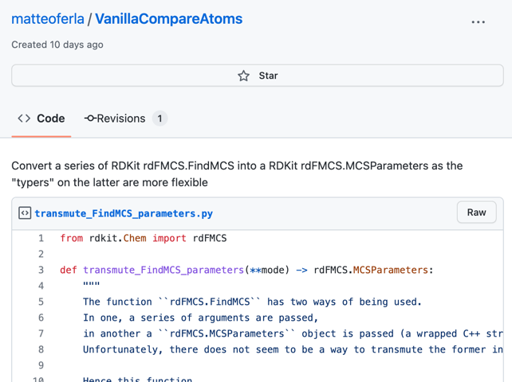

# gist-import
GitHub Gist are handy snippets, which are meant to be copy-pasted into one's code... but what if you could import them?

> This is a low-priority work-in-progress weekend project.
> And may completely forget about it in the future.
> As I currently need to find the main Jupyter notebook the code was in...

## Background

[GitHub Gist](https://gist.github.com/) are snippets that aren't part of regular GitHub,
they are intended to be used in blogs etc. to show code-hightlighting by embedding the gist.
If one were to use in it Python, one should copy-paste it or do something convoluted.



Say the gist is nice and isolated, with all the correct imports,
then this works fine.

```python
import requests

response = requests.get('https://gist.github.com/matteoferla/d0daee35fe6f598bc720ce0eeebbac97/raw/6f7ba15dde86f1066629af61e0724dbe6a62cceb/transmute_FindMCS_parameters.py')
response.raise_for_status()
exec(response.text)
transmute_FindMCS_parameters()
```

..but things get messy quickly. As seen in the comment in this Gist:

https://gist.github.com/matteoferla/24d9a319d05773ae219dd678a3aa11be


As a placeholder for the `response.text` in the following examples a string is used.

The following works:

```python
faux_gist:str = 'greet = lambda who: print(f"Hello {who}")'  # pretend this is the gist from `response.text`
exec(faux_gist)
greet('World')
```

But as soon as one moves away from the global namespace issues happen.
This would be needed were one to want to wrap the gist execution in a function
to avoid global namespace pollution.

This will fail:

```python
def nonglobal(faux_gist:str):
    exec(faux_gist)
    return greet  # NameError: name 'greet' is not defined
    
# assign to a variable with a different name
salute = nonglobal('greet = lambda who: print(f"Hello {who}")')
salute('Mars')
```

But this will pollute the global namespace:

```python
def nonglobal(faux_gist:str):
    exec(faux_gist, globals())
    return greet  # NameError: name 'greet' is not defined
    
# assign to a variable with a different name
salute = nonglobal('greet = lambda who: print(f"Hello {who}")')
salute('Mars')
assert 'greet' not in globals() # AssertionError: 
```

As `globals()` returns the actual global namespace, not a copy.
If a copy is passed the copy will have the new variable and the namespace will not be polluted.

```python
def nonglobal(faux_gist:str):
    faux_globals= {**globals(), **locals()}
    exec(faux_gist,  faux_globals)
    return faux_globals['beware']
  
# assign to a variable with a different name
enguard = nonglobal('import warnings; beware = lambda who: warnings.warn(f"Beware {who}")')
enguard('Mars')
assert 'beware' not in globals()
```

This used to not work in Python 3.7 due to the import being lost.
Hence the file imports.py...

So migrating my gist importing notebook is not actually useful anymore! Ops...